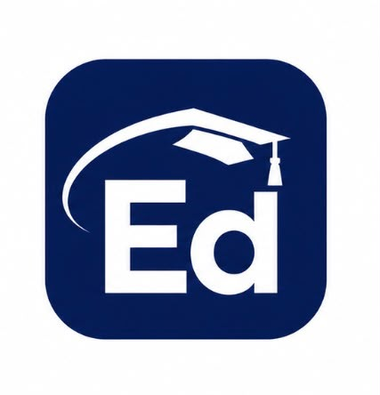
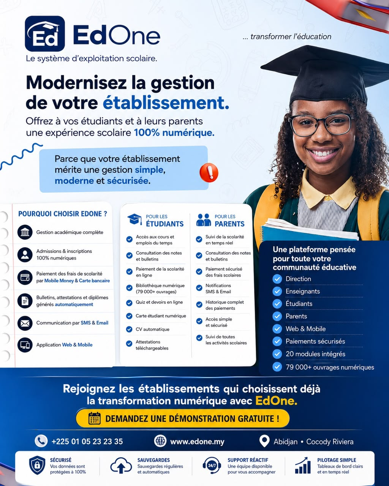
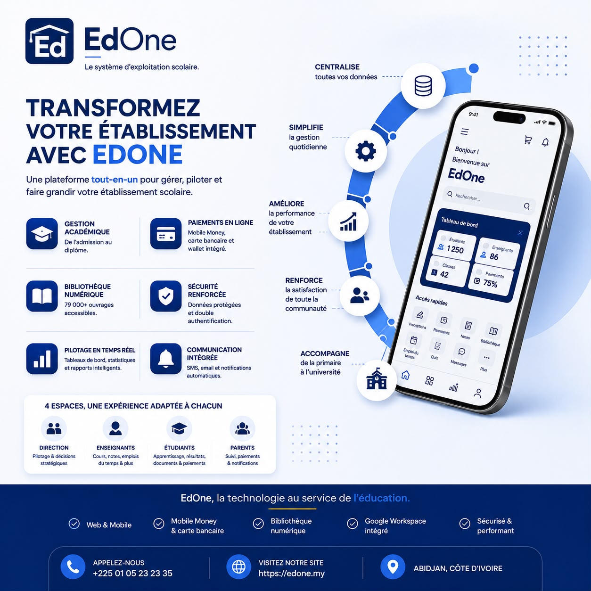
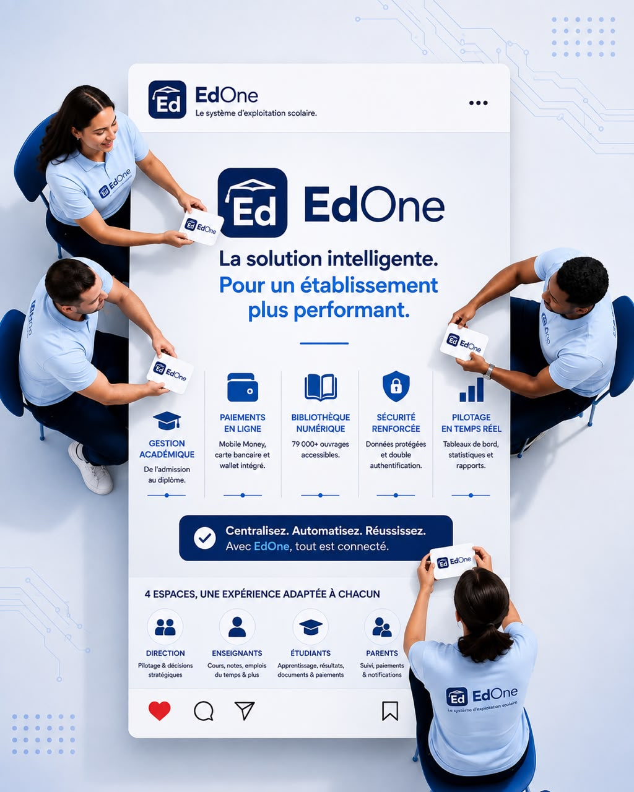
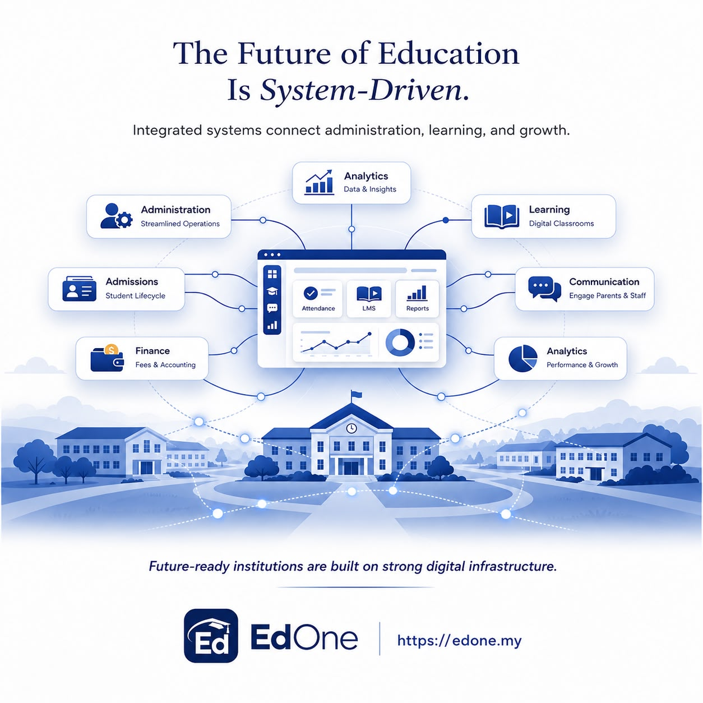

# EdOne

### Le système d'exploitation scolaire — Afrique & Europe

EdOne réunit **gestion académique, scolarité, paiements Mobile Money, bibliothèque numérique, quiz sécurisés, bulletins et diplômes vérifiables** dans une seule plateforme, active dans **25 pays** d'Afrique et d'Europe.

> Fini le carnet papier, les tableurs Excel et les outils qui ne communiquent pas entre eux. Toutes les données de l'établissement sont centralisées, en temps réel, avec des paiements directement intégrés aux flux quotidiens.



---

## 📊 En quelques chiffres

| | |
|---|---|
| **40+** | Modules & fonctionnalités métiers |
| **30+** | Profils & rôles utilisateurs |
| **79 000+** | Ouvrages accessibles en bibliothèque |
| **25** | Pays actifs en Afrique & Europe |
| **15+** | Devises supportées |
| **2 % + 100 FCFA** | Frais fixes par paiement en ligne |

---

## 🎓 Fonctionnalités — Pédagogie & vie de classe

- **Gestion académique** : années académiques, campus, salles, filières, niveaux, classes, maquettes pédagogiques
- **Inscription & réinscription** : dossier électronique complet, cartes étudiants, kits & accessoires, statistiques en direct
- **Emploi du temps** : planification par classe, émargements numériques, export PDF/Excel
- **Espace enseignant** : contrats, volume horaire, travaux dirigés, dépôt de supports, RIB, demandes d'acompte
- **Quiz sécurisés anti-triche** : QCM, choix multiples, réponses libres, tentatives limitées, détection de changement d'onglet
- **Devoirs individuels** : dépôt de fichier, consigne jointe, correction et appréciation par l'enseignant
- **Devoirs de groupe** : constitution des groupes, chef de groupe désigné, notation collective
- **Évaluations & notation** : import de notes par Excel, coefficients configurables, gestion des réclamations

---

## 📄 Fonctionnalités — Documents & certification officielle

- **Bulletins** générés automatiquement par semestre (moyennes pondérées, rangs, appréciations)
- **Procès-verbaux** de semestre et annuels, calcul des crédits, décisions de passage automatisées
- **Diplômes & certificats** avec code de vérification publique
- **Attestations de scolarité, de réussite et d'admission**, vérifiables via lien public
- **Reçus de paiement** automatiques, envoyés par SMS et e-mail
- **Carte étudiant** numérique et imprimable, avec photo
- **CV automatique**, généré à partir du parcours de l'étudiant, personnalisable et partageable
- **Vérification en ligne** : chaque document officiel est vérifiable publiquement via son code unique



---

## 💰 Fonctionnalités — Finance, wallet & ressources

- **Comptabilité & scolarité** : frais, plans de paiement, historique complet, statuts de solde
- **Wallet établissement** : solde en temps réel, demandes de reversement, historique des transactions
- **Abonnement & facturation** SaaS automatisée
- **Réconciliation automatique** des transactions, détection d'écarts
- **Stock & moyens généraux** : produits, fournisseurs, commandes, remise de kits
- **Ressources humaines** : fiches personnel, services, contrats, suivi RH
- **Demandes d'acompte** en ligne, validées par la comptabilité
- **Infirmerie** : dossiers médicaux, antécédents, consultations, arrêts de travail

---

## 📢 Fonctionnalités — Communication, sécurité & pilotage

- **Espace parent sécurisé** : accès par matricule, suivi complet du cursus, absences et paiements
- **Campagnes SMS & e-mail** ciblées par classe, filière ou niveau
- **Comptes & permissions** finement configurables par profil
- **Google Workspace intégré** : e-mail professionnel automatique, Drive, Docs, Sheets, Meet
- **Transport scolaire** : cars, trajets, abonnements payables en ligne
- **Double authentification (2FA)** pour les comptes sensibles
- **Dashboard 360°** : vue globale direction (effectifs, recouvrement, RH, académique)
- **Bibliothèque numérique** intégrée



---

## 📚 Bibliothèque numérique — 79 000+ ouvrages

Chaque établissement et ses étudiants accèdent **gratuitement** à une bibliothèque privée enrichie de :
- Catalogue du domaine public (79 000+ titres)
- Documents propres à l'établissement
- Partages entre étudiants, validés par l'administration
- Favoris personnels
- Lecture intégrée sécurisée, sans téléchargement libre

---

## 📈 Tableaux de bord — Web & mobile

- **Dashboard direction (web)** : effectifs, taux de recouvrement, encaissements du mois, enseignants actifs, évolution des inscriptions & paiements, répartition par cycle
- **Applications mobiles dédiées** pour chaque profil :
  - **Espace Parent** — scolarité réglée, absences, échéances, bulletins
  - **Espace Étudiant** — notes, quiz sécurisés, bibliothèque, paiements en attente
  - **Espace Enseignant** — devoirs à corriger, contrats, demandes d'acompte


---

## 💳 Paiements en ligne

EdOne connecte nativement, dans **25 pays** :

**Mobile Money** — Orange Money · MTN Mobile Money · Moov Money · Wave
**Cartes bancaires** — Visa · Mastercard

Frais simples et transparents : **2 % du montant + 100 FCFA**, identiques quel que soit le moyen de paiement.

- Wallet établissement avec demandes de reversement
- Réconciliation automatique de chaque transaction
- Reçu automatique par SMS et e-mail à chaque règlement
- Paiement possible pour la scolarité, le transport, la carte et les kits

**Devises supportées :** XOF · XAF · GHS · NGN · KES · TZS · UGX · RWF · ZMW · MWK · MZN · SLL · ETB · LSL · EUR

---

## 🌍 Couverture géographique

Un seul rail de paiement, **25 pays connectés**, avec un hub opérationnel basé à **Abidjan**.

Côte d'Ivoire · Sénégal · Mali · Guinée · Sierra Leone · Burkina Faso · Ghana · Togo · Bénin · Niger · Nigéria · Tchad · Cameroun · Gabon · Congo · RD Congo · Éthiopie · Ouganda · Kenya · Rwanda · Tanzanie · Zambie · Malawi · Mozambique · Lesotho

---

## 👥 Un espace pour chaque profil

| Profil | Ce qu'il peut faire |
|---|---|
| **Direction & administration** | Multi-établissements, permissions granulaires, diplômes/PV/attestations, wallet & réconciliation, campagnes SMS/e-mail, dashboard 360° |
| **Enseignants** | Contrats, volume horaire, import de notes Excel, quiz & devoirs sécurisés, coefficients, demandes d'acompte, RIB & présence |
| **Étudiants** | Maquette pédagogique, quiz, devoirs, notes, bulletins, paiement Mobile Money/carte, CV auto, bibliothèque, e-mail pro |
| **Parents** | Accès par matricule, suivi cursus/notes/bulletins, alertes d'absences, paiement de la scolarité, notifications SMS/e-mail |


---

## 🔒 Sécurité & conformité

- **Isolation multi-établissement** : chaque requête filtrée, aucune fuite possible entre écoles
- **Chiffrement & HTTPS** : mots de passe hashés, connexions chiffrées de bout en bout
- **Double authentification (2FA)** pour les comptes super administrateurs
- **Sauvegardes automatisées** avec procédure de restauration testée
- **Conformité RGPD**
- **Traçabilité complète** : chaque paiement et modification de note est horodaté et attribué

---

## 🤝 Programme partenaires / affiliation

Devenez fournisseur officiel de la solution EdOne :

1. **Devenez partenaire** — signez l'accord de distribution
2. **Recevez votre licence marque blanche** — déployez EdOne à vos couleurs
3. **Onboardez vos écoles clientes** — installation, formation, accompagnement
4. **Gérez & percevez vos commissions** — depuis votre dashboard partenaire dédié

**Avantages :**
- **100 000 FCFA** de prime d'installation par établissement signé
- **10 % à vie** sur chaque abonnement mensuel payé
- Dashboard partenaire pour piloter tous vos clients
- Support technique & formation dédiés
- Matériel commercial et démo prêts à l'emploi



---

## 💵 Tarifs

| Plan | Prix | Cible |
|---|---|---|
| **Starter** | 25 000 FCFA/mois (~38 EUR) | Jusqu'à 200 étudiants — petites écoles, centres de formation |
| **School** ⭐ | 75 000 FCFA/mois (~115 EUR) | Jusqu'à 800 étudiants — collèges, lycées |
| **Campus** | 200 000 FCFA/mois (~300 EUR) | Jusqu'à 3 000 étudiants — universités, grandes écoles |
| **Enterprise** | Sur devis | Étudiants illimités — groupes scolaires, réseaux & partenaires |

*Frais de transaction (2 % + 100 FCFA) identiques quel que soit le plan choisi.*



---

## ❓ FAQ

**Combien coûte un paiement en ligne pour un parent ?**
2 % du montant réglé + 100 FCFA fixes par transaction, quel que soit le moyen de paiement.

**Comment fonctionne la bibliothèque de 79 000 ouvrages ?**
Accès gratuit au catalogue du domaine public, enrichi par les documents de l'école et les partages entre étudiants (validés avant publication).

**Puis-je devenir partenaire et revendre EdOne ?**
Oui, via le programme d'intégrateurs (prime + commission récurrente).

**Quels pays sont couverts pour les paiements ?**
Plus de 25 pays d'Afrique et d'Europe, 15+ devises.

**Nos données sont-elles en sécurité ?**
Oui — isolation totale entre établissements, chiffrement, sauvegardes automatiques, conformité RGPD.

**Combien de temps prend le déploiement ?**
Généralement une à trois semaines, import des données et formation comprises.

---

## 💬 Contact & démo

- **WhatsApp :** [+225 01 05 23 23 35](https://wa.me/2250105232335)
- **E-mail :** octogone.techs@gmail.com
- **Adresse :** Abidjan, Cocody Riviera

La page inclut un formulaire de demande de démo qui redirige directement vers WhatsApp avec un message pré-rempli, prêt à être envoyé à l'équipe EdOne.

---

## 🗂️ Fichiers du projet

```
edone_html/
├── images/
│   ├── 1.jpeg     → logo / sceau EdOne
│   ├── 3.jpeg     → support « Voir, pas deviner »
│   ├── 4.jpeg     → support « Infrastructure numérique intégrée »
│   ├── 5.jpeg     → support « Présentation établissement »
│   ├── 6.jpeg     → support « Programme intégrateurs »
│   ├── 9.jpeg     → support « Transformer l'établissement »
│   └── 10.jpeg    → support « La solution intelligente »
├── landing.html   → page complète (HTML/CSS/JS pur, sans backend)
└── README.md      → ce document
```

Page 100 % statique : aucune installation, aucun serveur, aucune dépendance externe requise.

---

*EdOne — OCTOGONE TECHNOLOGIES*# edone_html
